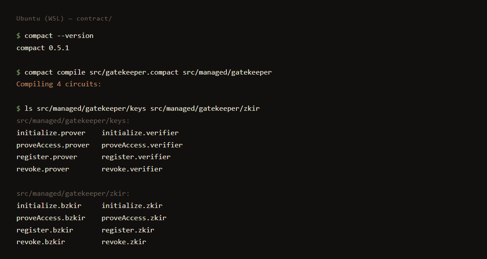
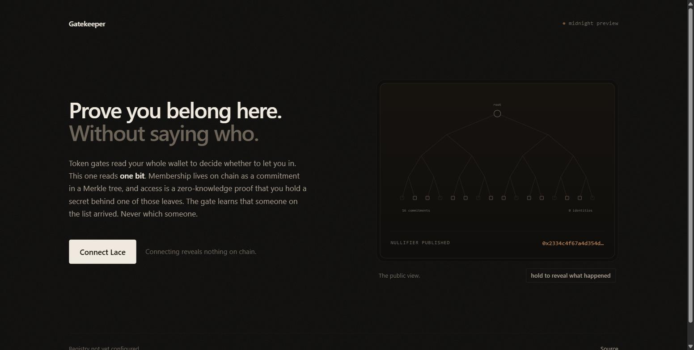

# Gatekeeper

**Anonymous, revocable allowlist access on Midnight.**

[](https://github.com/Venkat5599/mn/actions/workflows/ci.yml)
[](https://midnight-rust-psi.vercel.app)

| | |
| --- | --- |
| Live dApp | https://midnight-rust-psi.vercel.app |
| Network | Midnight Preview |
| Contract address | **Pending** — see [Deployment](#deployment) |
| Source | https://github.com/Venkat5599/mn |

An operator issues credentials to approved people. Those people prove they are
on the list — to a newsroom, a clinic, a support forum, a beta programme —
without revealing who they are, and without any two of those places being able
to work out they saw the same person. When the operator revokes someone, that
person is locked out immediately, and the proofs they already hold stop working.

Chosen problem (Level 3, from the provided list): **Private Allowlist Access —
prove membership without revealing identity.**

## The idea

Most token-gated apps today work by asking you to connect a wallet and then
reading everything in it. The app learns your whole balance history and every
other app you have touched. Gatekeeper flips that: the app should only ever
learn one thing — **are you allowed in, or not.** Nothing else.

So membership lives as a commitment inside a Merkle tree, and access is granted
by a zero-knowledge proof rather than by showing a wallet. The operator
publishes a tree of *commitments*, hashes of secrets only the holders know. To
get in, a holder proves in zero knowledge that they know a secret whose hash
sits somewhere in that tree, and publishes a nullifier instead of an identity.

The nullifier is hashed from the secret plus the verifier id plus the current
epoch. Scoping it to the verifier means two different sites cannot correlate the
same person across both of them. Scoping it to the epoch means a revocation
kills proofs that were already outstanding, and not only future ones. The public
ledger holds commitments, a nullifier set, an epoch counter and an access count.
It holds zero identities.

Private allowlists are the boring plumbing a lot of real things need: DAO voting
gates, paid community access, age checks, employer verification. All of them
currently leak far more than they need to. Midnight is the only chain where the
allowlist can sit on chain while the membership itself stays private, which is
the whole reason it was picked.

The design is not "hide everything." It is a specific, defensible choice about
which single fact becomes public and which stay private.

## Public state vs private witness

Everything in the `ledger` declarations of
[`contract/src/gatekeeper.compact`](contract/src/gatekeeper.compact) is on chain
and readable by anyone. Everything declared `witness` never leaves the holder's
machine.

### Public ledger state

| Field | Type | What it is | What it leaks |
| --- | --- | --- | --- |
| `members` | `HistoricMerkleTree<10, Bytes<32>>` | Commitments of approved members | How many members exist. Each leaf is `H("gk:commit", secret)`, so it identifies nobody. |
| `nullifiers` | `Set<Bytes<32>>` | Spent access tokens | How many accesses happened. Each is `H("gk:null", secret, verifier, epoch)` — an opaque hash. |
| `epoch` | `Counter` | Bumped on every revocation | How many revocations have occurred. |
| `accessCount` | `Counter` | Total successful accesses | Aggregate usage, and nothing per-person. |
| `admin` | `Bytes<32>` | Commitment of the operator | That an operator exists. Not who they are. |

### Private witnesses

| Witness | What it is | Why it is private |
| --- | --- | --- |
| `memberSecret()` | The holder's 32-byte root secret | It *is* the credential. Anyone holding it is the member. It is used inside the proof to recompute the commitment and derive the nullifier, and is never disclosed. |
| `memberPath()` | Merkle authentication path from the holder's commitment to a valid root | The path identifies *which leaf* the holder occupies. Publishing it would deanonymise them completely. |

### Where `disclose()` is used, and why

The compiler refuses to publish anything derived from a witness unless you say
so explicitly. There are exactly four `disclose()` calls, and each is a
deliberate decision:

- `initialize` — discloses the operator's commitment. A hash, not an identity.
- `register` — discloses the commitment being added. The operator already knows
  it; they issued it.
- `revoke` — discloses the leaf index being cleared. Which slot is being emptied
  is inherently public, since the tree is public.
- `proveAccess` — discloses the Merkle **root** (already public ledger state; a
  root does not say which leaf produced it) and the **nullifier**. Nothing else.

Notably, `proveAccess` does *not* disclose the secret, the commitment, or the
path — so an access cannot be traced back to a registration.

## Privacy model: what an observer can and cannot learn

Assume an observer who reads every block, plus the verifier being proven to, plus
the registry operator. All of them, cooperating.

**They can learn:**

- how many members are registered, and how many have been revoked;
- how many accesses have occurred in total, and at their own verifier;
- that a given access was made by *someone* who was on the list at the time.

**They cannot learn:**

- which member performed any given access;
- whether two accesses at *different* verifiers came from the same member — the
  nullifier is salted with `verifierId`, so colluding verifiers see two unrelated
  hashes;
- anything at all about a member who never proves access;
- a member's secret, from any amount of on-chain data.

**Deliberate, and worth stating plainly:** repeat visits by one member to *one*
verifier within one epoch are prevented, not hidden — that is the entire purpose
of the nullifier. One credential, one access per verifier per epoch. Enforcing
uniqueness necessarily means publishing something stable per (member, verifier,
epoch), and the nullifier is the minimum such thing.

### Revocation is immediate, not eventual

This is the part that is easy to get wrong. Clearing a leaf is not enough: a
revoked member already holds a Merkle path to an *older* root, and a naive
contract would happily accept a proof against it. `revoke` therefore does three
things:

1. zeroes the leaf, removing the member from the tree;
2. calls `resetHistory()`, invalidating every previously-valid root, so stale
   paths stop verifying;
3. bumps `epoch`, which changes every member's nullifier, so a proof built before
   the revocation cannot be replayed after it.

Non-revoked members are unaffected — they rebuild their path from the current
public tree, which needs no help from the operator.

## Repository layout

```
contract/
  src/gatekeeper.compact          the contract
  src/index.ts                    what consumers import
  src/witnesses.ts                witness implementations (local, never sent)
  src/types.ts                    private state
  src/test/simulator.ts           runs circuits against the real Compact runtime
  src/test/gatekeeper.test.ts     the test suite
  src/managed/gatekeeper/         compiler output: circuits, keys, ZKIR
  compile.sh                      compiles via WSL on Windows
deploy/
  src/new-wallet.ts               generates a throwaway seed
  src/address.ts                  prints the address and balance
  src/deploy.ts                   deploys, then binds the operator
  src/providers.ts                compiled-contract binding + providers
  src/zk-config.ts                serves ZK artifacts from disk
frontend/
  src/App.tsx                     the page
  src/Plate.tsx                   the allowlist, drawn
  src/lib/lace.ts                 wallet connect / disconnect
.github/workflows/ci.yml          compile + typecheck + test on every push
vercel.json                       build config for the deployed dApp
```

## Running it locally

Requires **Node 22+**, **Docker** (for the proof server), and the **Compact
toolchain**. On Windows, install the toolchain inside WSL — the compiler ships
for Linux and macOS only, and Windows has its own unrelated `compact.exe` (the
NTFS compression tool) that will shadow it on `PATH`.

```bash
# 1. Compact toolchain
curl --proto '=https' --tlsv1.2 -LsSf \
  https://github.com/midnightntwrk/compact/releases/latest/download/compact-installer.sh | sh
export PATH="$HOME/.local/bin:$PATH"
compact update
compact --version         # compact 0.5.1 at time of writing

# 2. Compile the circuits and run the tests
cd contract
npm install
npm run compact           # writes src/managed/gatekeeper/
npm test

# 3. Proof server, for anything that touches a real network
docker run -d -p 6300:6300 -e PORT=6300 midnightnetwork/proof-server:latest

# 4. The dApp
cd ../frontend
npm install
npm run dev               # http://localhost:5173
```

On Windows, step 2's compile is `wsl -d Ubuntu -- bash contract/compile.sh`.

The compiler prints exactly this, and nothing more — it reports the count, not
the names:

```
$ compact compile src/gatekeeper.compact src/managed/gatekeeper
Compiling 4 circuits:
```

The four circuits it built are visible in the output tree:

```
$ ls src/managed/gatekeeper/keys src/managed/gatekeeper/zkir
keys: initialize.prover  initialize.verifier   proveAccess.prover  proveAccess.verifier
      register.prover    register.verifier     revoke.prover       revoke.verifier
zkir: initialize.zkir    proveAccess.zkir      register.zkir       revoke.zkir
```



The same output, as plain text, is in
[`docs/screenshots/compile-output.txt`](docs/screenshots/compile-output.txt).

`src/managed/gatekeeper/` holds `contract/` (generated TypeScript), `keys/`
(prover and verifier keys per circuit) and `zkir/` (the ZK intermediate
representation, in both readable and binary form).

## Deployment

The proof server must be running first: proving happens locally, because a
proof server is handed the witness, and sending that to someone else's host
would give away the secret this design exists to protect.

```bash
cd deploy
npm install
npm run new-wallet        # writes a throwaway seed to deploy/.env (gitignored)
npm run address           # prints the address; fund it from the faucet
npm run deploy            # deploys, then calls initialize
```

Deployment is two transactions on purpose. The first puts the circuits and an
empty ledger on chain; `initialize` then writes the operator commitment into
`admin`. Keeping them apart means the registry is inert until somebody proves
they hold the operator secret, rather than the contract trusting whoever
happened to submit the deployment.

The result is recorded in `deploy/deployment.json`:

```json
{
  "network": "preview",
  "contractAddress": "0200…",
  "deployTxId": "…",
  "initializeTxId": "…",
  "operatorCommitment": "…",
  "deployedAt": "2026-07-31T00:00:00.000Z"
}
```


A note on networks, because it cost real time: the `testnet-02` endpoints this
project started against no longer resolve, and the indexer's GraphQL path moved
to `/api/v3/graphql`. A wrong endpoint fails silently — the wallet still builds
and still prints a correct address, because the address derives locally from the
seed, and simply never syncs. The symptom looks like an empty wallet rather than
a bad URL.

## Tests

```
$ npm test

 ✓ src/test/gatekeeper.test.ts (14 tests) 571ms

 Test Files  1 passed (1)
      Tests  14 passed (14)
```

The suite runs the circuits through the real Compact runtime — the same
interpreter the chain uses, minus proof generation — so every `assert` in the
contract fires exactly as it would on Preprod. It covers the operator checks,
the membership proof, double-spend rejection, cross-verifier unlinkability, and
each of the three things revocation has to do.

## The dApp



Holding "reveal what happened" traces the proof back to the leaf it came from —
the view the chain never gets:


The page does one thing, because the product is one thing. It connects Lace,
reports what the wallet told it, and says plainly what that does and does not
reveal. Live at **https://midnight-rust-psi.vercel.app**, redeployed by Vercel
on every push to `master`.

Connect and disconnect are honest about their limits. The DApp connector API
has no revoke method — permission lives in the extension, and only the user can
withdraw it there — so the button says "forget this session" rather than
implying a revocation that did not happen.

The dApp also refuses to proceed if the wallet reports a different network than
it was built for, rather than letting anyone sign against the wrong chain by
accident.

## Progress against the challenge

**Level 1 — New Moon**

- [x] Toolchain installed; contract compiles via `compact compile`
- [x] Passing test suite (14 tests)
- [x] `managed/` present (circuits + keys + ZKIR)
- [x] Public GitHub repository with README and setup instructions
- [x] Screenshot of successful compile output
- [x] README section explaining public state vs private witness
- [x] Initial product idea paragraph
- [x] Minimum 5 meaningful commits

**Level 2 — Waxing Crescent**

- [x] Lace wallet connect / disconnect implemented
- [x] Live demo link
- [x] README documenting the privacy claim
- [x] Minimum 8 meaningful commits
- [ ] Deployed contract with a verifiable address — blocked, see [Deployment](#deployment)
- [ ] Demo video: wallet connect + a successful circuit call — see [docs/video](docs/video/)

**Level 3 — First Quarter**

- [x] Approved idea from the provided list (Private Allowlist Access)
- [x] 3+ tests passing (14)
- [x] CI/CD pipeline running, with badges above
- [x] README "privacy model" section: what an observer can and cannot learn
- [x] Minimum 10 meaningful commits
- [ ] Demo video (1 minute) showing full functionality — see [docs/video](docs/video/)

**Level 4 — Waxing Gibbous**

- [x] MVP live
- [x] Documentation: README, setup, usage
- [x] CI/CD running on the product repo
- [x] Minimum 15 meaningful commits
- [ ] Verifiable contract address — blocked, see [Deployment](#deployment)
- [ ] Product X profile, linked here
- [ ] Demo video of the MVP — see [docs/video](docs/video/)

Two of the unticked items cannot be produced from a repository at all: a screen
recording and a social profile. The third is a live blocker rather than
unfinished work — the deployment pipeline is written and runs end to end up to
the point of needing funds, and the faucet is the thing in the way. See
[Deployment](#deployment).

## Where this goes next

Three things, in the order they unlock value:

**Multiple issuers.** Today there is one operator commitment. An issuer registry
would let a DAO, a university and an employer each hold their own subtree and
their own revocation epoch. A verifier then declares which issuers it trusts,
and the proof carries an issuer index without leaking which specific credential
was used beyond that set.

**Time- and role-bound credentials.** Adding expiry and role fields to the leaf
preimage — so the leaf becomes a hash over secret, role and expiry — lets the
circuit assert that the claimed role matches what the verifier asked for and
that the current block time is under expiry. The user still never reveals which
leaf they are.

**Reusable across dApps.** Because the nullifier already takes a verifier id as
input, one credential can be presented to many apps without any of them linking
the presentations. Wrapping that into a small TypeScript SDK would let any
Midnight dApp drop in a verify call.

## A note on a bug that mattered

The first version of `register` used `members.insertHash(commitment)`, which
writes the commitment into the tree verbatim. But `proveAccess` validates a path
with `merkleTreePathRoot()`, which applies `leafHash()` to the leaf before
folding upward. The two disagreed, so `checkRoot()` rejected every honestly
constructed proof: the contract compiled, would have deployed, and could never
have admitted anybody. Switching to `members.insert()` — which stores
`leafHash(commitment)` — fixed it. The test suite exists partly because this
class of mistake is invisible until something actually tries to prove
membership.
